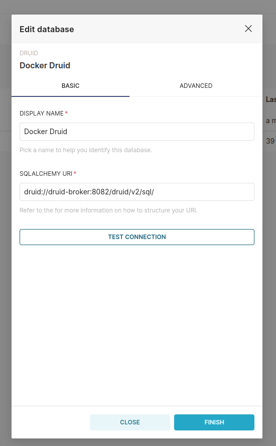

# druid-experimentation
A repository with stuff experimentating apache druid.


- Currently, following this: https://druid.apache.org/docs/latest/tutorials/docker.html

## Superset
I'll use Superset as data viz tool. To configure the connection do the following:




## Step by Step
Criar um tópico.

```
./bin/kafka-topics --create --topic initial-topic --partitions 1 --bootstrap-server localhost:29092
```

Listar tópicos:
```
./bin/kafka-topics --list --bootstrap-server localhost:29092
```