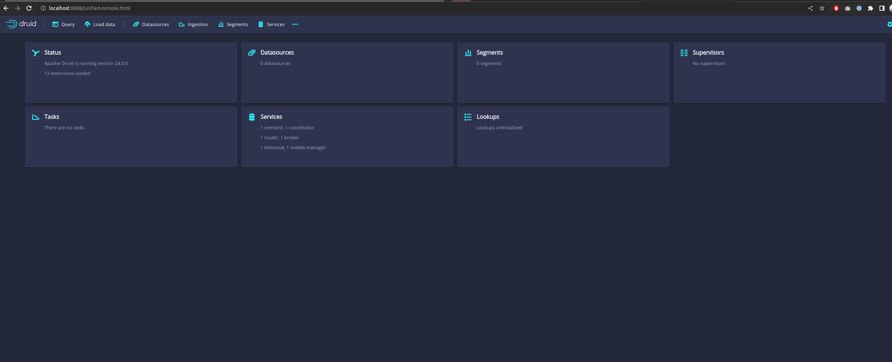
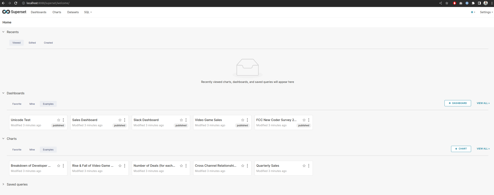
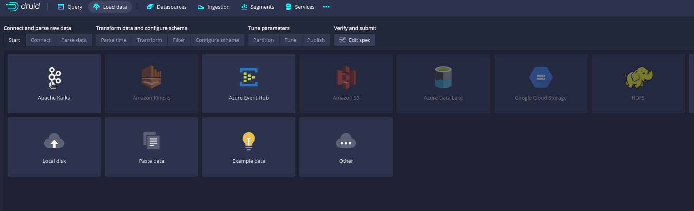
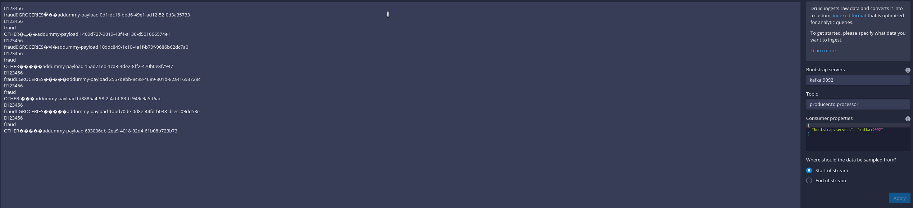
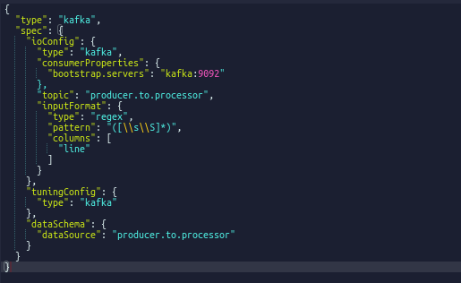
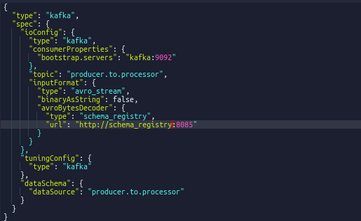
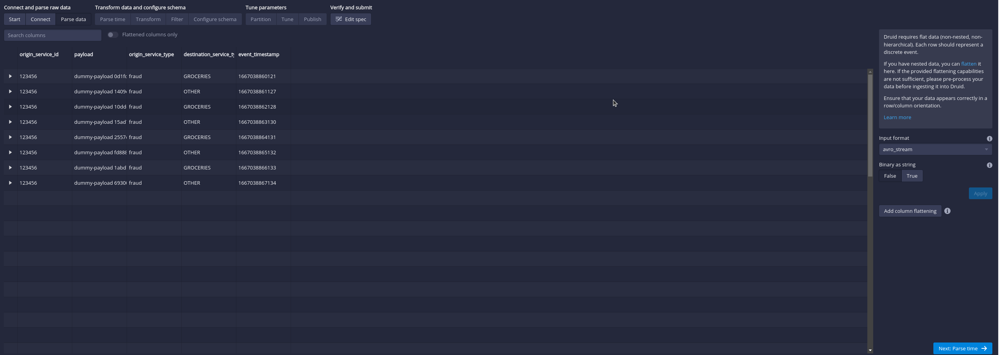
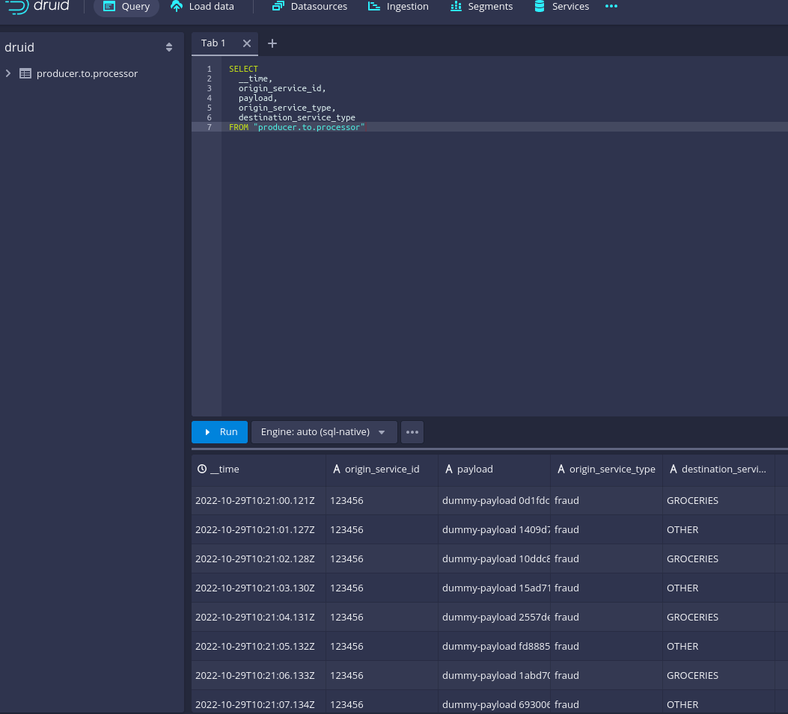
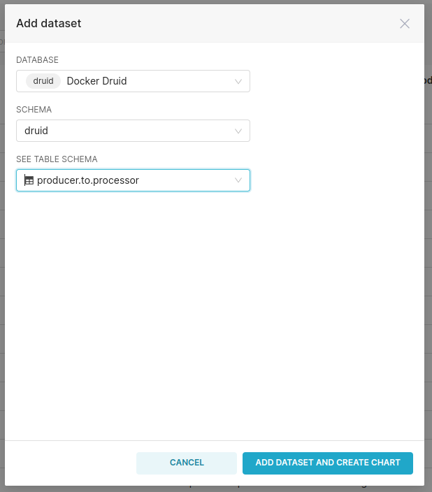
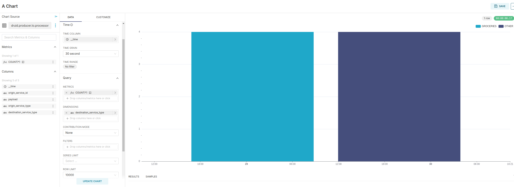

# Experimenting with Druid
A repository with stuff experimentating Apache Druid and other stuff.
This is the current result of following this:

[](https://youtu.be/g9tRZy3d5xg)


Some of the sources:

- https://druid.apache.org/docs/latest/tutorials/docker.html
- https://blog.hellmar-becker.de/2021/10/19/reading-avro-streams-from-confluent-cloud-into-druid/

## Step by Step

This step by step is made for Linux.  
Mac users may have trouble with memory limits of Docker (I've read this somewhere), having to adjust some configurations.

### Clonning submodules
After clonning this repository, run:

```
git submodule init
git submodule update
```

This will fetch the submodules used into this experiment.

### Starting the environment
Keep in mind that the environment is composed of 15 containers.
If you have a small amount of RAM (16GB), please, reboot your machine before trying this.
If you do have containers created from previous experiments with this docker file, inside docker folder, run:

```
make purge-containers
make purge-volumes
```

This clears the whole environment, giving you a fresh start.
To check that the environment is clear, just run

```
docker ps -a
```

If none of the images listed below is present, you are good to go.

```
schema_registry
middlemanager
router
druid-broker
historical
coordinator
superset_app
superset_worker_beat
superset_worker
superset_init
zookeeper
superset_cache
superset_db
postgres
kafka
```

Then, run `make start-environment-block` to run the whole environment. 
It takes a minute or two to spin up the whole circus.  
To check if everything is ok:
- Access the localhost:8888. This is the Druid endpoint, check if there are any error messages there.

- Access the localhost:8088. This is the Superset endpoint, check if there are any error messages there.

- Perform curls on kafka and schema registry, both have to successfully connect. **Note: the port to access the kafka broker from the host is 29092, inside the docker network, it is 9092**.
```
telnet localhost 29092
telnet localhost 8085
```

This completes the spin up of the environment.

### Putting data on Kafka
The whole idea of the experiment is to show data being ingested in Kafka in NRT. To do this, we have to produce messages to a kafka topic.

In a past project, I've coded a simple Kafka producer in python using avro as the message protocol, and have used it here to produce messages.
To use it:
- Access the `kafka-producer` folder on the root of the repository.
- Create a virtual environment because there will be some packages installed in your python environment.
- Run `make local-setup`, this installs the required libraries.
- Run `make local-generate-classes-from-avro-schemas` to generate classes based on the avro schemas.
- Run `make local-register-schemas` in order to register the schemas in Schema Registry. Please, do check if the port set is the correct one (I had to change to 8085).
- Add the `kafka-producer` folder to your PYTHONPATH. For me it was:
```
export PYTHONPATH=$PYTHONPATH:/home/alexandrekentasalgueiromiyazaki/Documents/personal-repos/druid-experimentation/kafka-producer
```
- Run the producer with a small set of messages to be produced:
```
python dummy_producer/main.py -bootstrap_server localhost:29092 \
        -schema_registry_url http://localhost:8085 \
        -target_topic producer.to.processor \
        -origin_service_type fraud \
        -origin_service_id 123456 \
        -list_of_destinations groceries other \
        -amount_of_messages 8 \
        -sleep_between_messages_in_seconds 1 \
        -log_level INFO
```
- To check if messages have arrived in the Kafka topic, please download a version of the confluent community package [here](https://www.confluent.io/previous-versions/) and extract somewhere.
- Use the `bin/kafka-avro-console-consumer` to read messages from the topic, it should print eight messages.
```
./bin/kafka-avro-console-consumer --bootstrap-server localhost:29092 \
        --topic producer.to.processor \
        --property schema.registry.url="http://localhost:8085" \
        --from-beginning
```

If this works well, you had just written into Kafka! Now, let's configure Druid to ingest data from this topic.

### Configuring Druid Ingestion
To configure druid ingestion, go to load data on the upper left corner.


Select Start new Spec and choose Apache Kafka as source.



Input the bootstrap servers and the topic in the right form and click apply.
Data will be loaded, but won't be in a nice format because of the AVRO serialization.



Click in Next anyway, then go to edit spec in the top center of the screen, it will show the json that configures the Druid ingestion job.
Notice that there's no data regarding schema registry, in this way, Druid can't convert the data in a nicer way.



Put the information of the avro stream there, in the same level ot the topic item.

```
"inputFormat": {
    "type": "avro_stream",
    "binaryAsString": false,
    "avroBytesDecoder": {
        "type": "schema_registry",
        "url": "http://schema_registry:8085"
    }
}
```

Your spec should look like this:  


Get back to the Parse tab, data should look like much better:



Keep going (next, next, next) for now, and choose segment by hour.
Set to use earliest offset on the publish window and hit publish.
Your final json spec should look like this:

```
{
  "type": "kafka",
  "spec": {
    "ioConfig": {
      "type": "kafka",
      "consumerProperties": {
        "bootstrap.servers": "kafka:9092"
      },
      "topic": "producer.to.processor",
      "inputFormat": {
        "type": "avro_stream",
        "binaryAsString": false,
        "avroBytesDecoder": {
          "type": "schema_registry",
          "url": "http://schema_registry:8085"
        }
      },
      "useEarliestOffset": true
    },
    "tuningConfig": {
      "type": "kafka"
    },
    "dataSchema": {
      "dataSource": "producer.to.processor",
      "timestampSpec": {
        "column": "event_timestamp",
        "format": "millis"
      },
      "dimensionsSpec": {
        "dimensions": [
          "origin_service_id",
          "payload",
          "origin_service_type",
          "destination_service_type"
        ]
      },
      "granularitySpec": {
        "queryGranularity": "none",
        "rollup": false,
        "segmentGranularity": "hour"
      }
    }
  }
}
```

In the druid UI, go to query give a Select * from the data source added to check if there's data.



This ends our druid configuration.


### Visualizing data into Superset
Keep in mind that Superset here is just a choice that I've made because of my interest for the platform.
This part can be made with any Viz tool that supports Druid as a source.

Let's start by adding druid as a source. Go to the Superset url and on the top right corner, click on `Settings` and then `Database Connections`.
Click on `+ Database`, choose Apache druid as source and put the following configurations:


Hit Test Connection, everything should look good and click add.

Then, go to Datasets, Click on `+ Dataset` and choose our source and our `producer.to.processor` table.



Hit Add Dataset and Create Chart.

Next, let's create the chart:
- Choose to create a Time-Series Bar Chart V2.
- Hit Create New Chart.
- Select COUNT as Metric
- Select the time grain to 30 seconds
- Select `destination_service_type` as dimension and hit Create Chart
.
- Go to customize tab and select "Stack Series" and click update chart
- Hit save, create a new dashboard and put your chart there, make sure that it occupies the whole screen.
- Then, start writing on kafka, I reccommend to start two processes in different terminals:
- Terminal 1:
```
python dummy_producer/main.py -bootstrap_server localhost:29092 \
        -schema_registry_url http://localhost:8085 \
        -target_topic producer.to.processor \
        -origin_service_type fraud \
        -origin_service_id 123456 \
        -list_of_destinations groceries other \
        -amount_of_messages 1000 \
        -sleep_between_messages_in_seconds 7 \
        -log_level INFO
```

- Terminal 2:
```
python dummy_producer/main.py -bootstrap_server localhost:29092 \
        -schema_registry_url http://localhost:8085 \
        -target_topic producer.to.processor \
        -origin_service_type order \
        -origin_service_id 123456 \
        -list_of_destinations groceries marketing fraud \
        -amount_of_messages 2000 \
        -sleep_between_messages_in_seconds 3 \
        -log_level INFO
```

Now, profit.